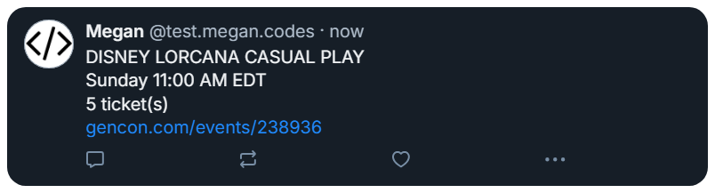

[![Contributors][contributors-shield]][contributors-url] [![LinkedIn][linkedin-shield]][linkedin-url]

> [!NOTE]
> ***This project is being updated to move from twitters api (Python) to [Bluesky](https://bsky.app/)'s API (Typescript). The original project can be found [here](https://github.com/mriffey1/lorcana-scraper-2023).***

<h3 align="center">Lorcana Web Scraper</h3>
  

    TypeScript script created to obtain ticket availability for Lorcana events at Gen Con and tweet when tickets are available.

  
Table of Contents

  <ol>
    <li>
      <a href="#about-the-project">About The Project</a>
      <ul>
        <li><a href="#built-with">Built With</a></li>
      </ul>
    </li>
  </ol>

## About The Project

This project was created due to the popularity of the up and coming Disney trading card game, Lorcana by Ravensburger. Lorcana debuted at [Gen Con](https://www.gencon.com/) 2023, North America's largest and longest running tabletop convention. The goal was to provide a singular location with the ability to receive real-time notifications of event ticket availability for over 40 events dedicated to Lorcana.

The screenshot below shows when an event has been tweeted that has tickets by providing the name of the event, the date and time, number of tickets available, the direct event link and a timestamp.

  (<a href="#readme-top">back to top</a>)

### Built With

<table>
  <tr>
  <td align="center">

  

  </td>
  <td align="center">

  

  </td>
  <td align="center">

  

  </td>
  </tr>
  <tr>
  <td align="center">

  

  </td>
  <td align="center">

  

  </td>
  <td align="center">

  

  </td>
  </tr>
  <tr>
  <td align="center">

  

  </td>
  <td align="center">

  

  </td>
  <td align="center">
  </td>
  </tr>
 </table>

(<a href="#readme-top">back to top</a>)

[contributors-shield]: https://img.shields.io/github/contributors/mriffey1/lorcana-scraper.svg?style=for-the-badge
[contributors-url]: https://github.com/mriffey1/lorcana-scraper/graphs/contributors
[linkedin-shield]: https://img.shields.io/badge/-LinkedIn-black.svg?style=for-the-badge&logo=linkedin&colorB=555
[linkedin-url]: https://linkedin.com/in/mriffey
